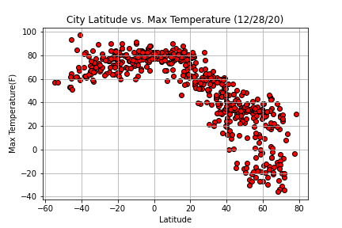
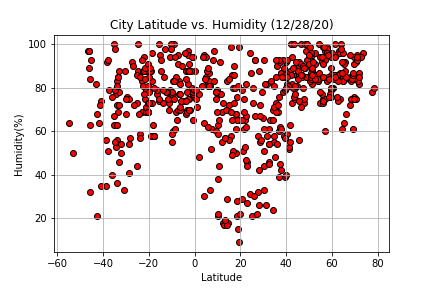
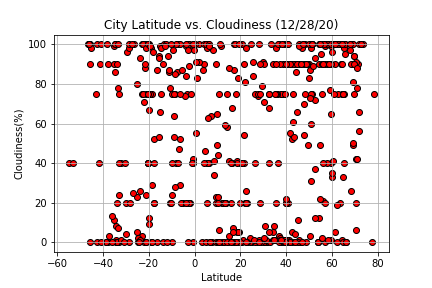
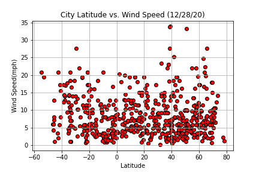
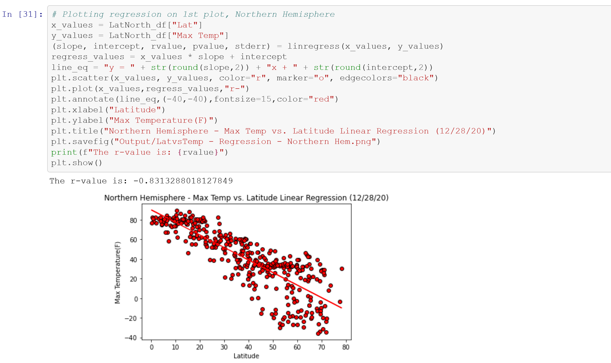
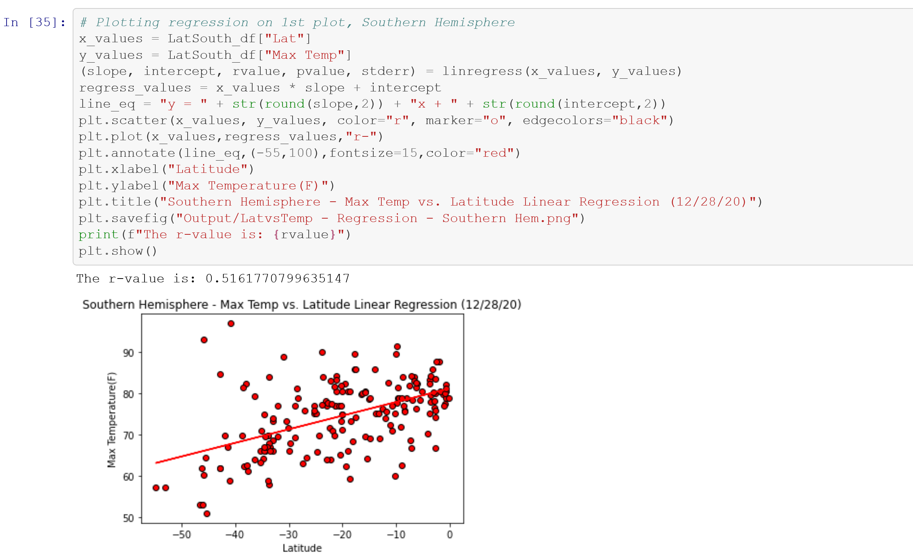

# geo-mapping-with-apis

Part I - WeatherPy

In this example, I'll be creating a Python script to visualize the weather of 500+ cities across the world of varying distance from the equator. To accomplish this, I'll be utilizing a simple Python library, the OpenWeatherMap API, and a little common sense to create a representative model of weather across world cities.

The first requirement is to create a series of scatter plots to showcase the following relationships:

    Temperature (F) vs. Latitude
    Humidity (%) vs. Latitude
    Cloudiness (%) vs. Latitude
    Wind Speed (mph) vs. Latitude

The second requirement is to run linear regression on each relationship. This time, I'll separate the plots into Northern Hemisphere (greater than or equal to 0 degrees latitude) and Southern Hemisphere (less than 0 degrees latitude):

    Northern Hemisphere - Temperature (F) vs. Latitude
    Southern Hemisphere - Temperature (F) vs. Latitude
    Northern Hemisphere - Humidity (%) vs. Latitude
    Southern Hemisphere - Humidity (%) vs. Latitude
    Northern Hemisphere - Cloudiness (%) vs. Latitude
    Southern Hemisphere - Cloudiness (%) vs. Latitude
    Northern Hemisphere - Wind Speed (mph) vs. Latitude
    Southern Hemisphere - Wind Speed (mph) vs. Latitude

Part II - VacationPy

Now I'll use my skills in working with weather data to plan future vacations. I will use jupyter-gmaps and the Google Places API for this part of the assignment.

To complete this part of the assignment, I will do the following:

    Create a heat map that displays the humidity for every city from Part I.
    
    Narrow down the DataFrame to find an ideal weather condition.
    
    Use Google Places API to find the first hotel for each city located within 5000 meters of coordinates.
    
    Plot the hotels on top of the humidity heatmap with each pin containing the Hotel Name, City, and Country.

​    

